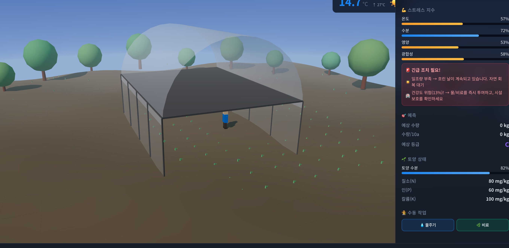
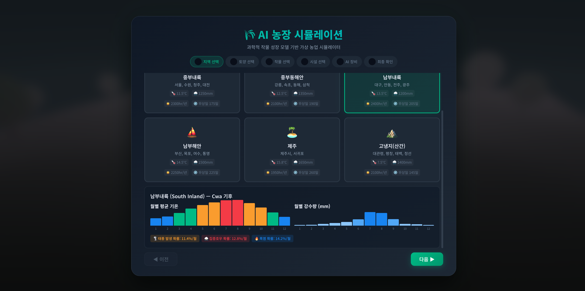
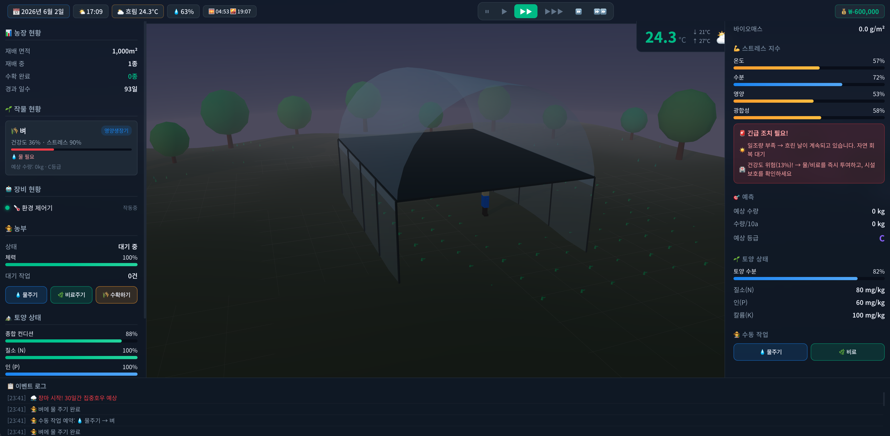
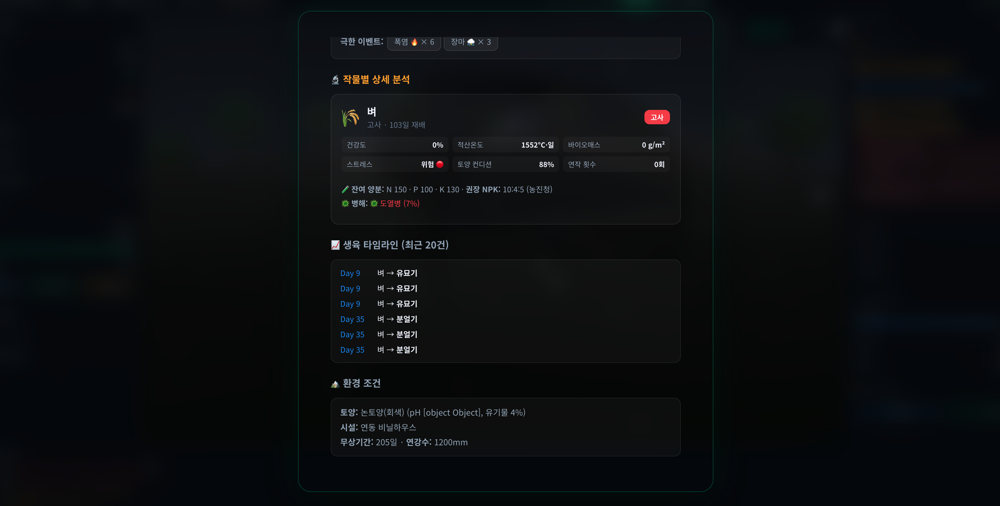

<p align="center">
  
</p>

<h1 align="center">🌾 추수꿈 — AI 농장 시뮬레이터</h1>

<p align="center">
  <strong>8편의 학술 논문 · 6개 공공 데이터셋 · 10개 작물 · 20종 병해충 — 과학적 근거 기반 고정밀 농업 시뮬레이션</strong>
</p>

<p align="center">
  <a href="https://choosukkum.vercel.app">🌐 라이브 데모</a> •
  <a href="#-과학적-근거-scientific-references">📚 과학적 근거</a> •
  <a href="#-참고-문헌-full-references">📑 참고 문헌</a>
</p>

---

## 🎮 게임 미리보기

### 📋 6단계 설정 마법사

| 기후 구역 선택 | 토양 선택 | 작물 선택 |
|:---:|:---:|:---:|
|  |  |  |

| 시설 선택 | AI 장비 | 시뮬레이션 플레이 |
|:---:|:---:|:---:|
|  |  |  |

### 🎓 교육 이벤트 & 분석 보고서

| 특수 이벤트 알림 (자동 일시정지) | 게임 종료 분석 보고서 |
|:---:|:---:|
|  |  |

---

## ✨ 주요 기능

| 기능 | 설명 |
|------|------|
| **3D 농장 시각화** | Three.js 기반 실시간 3D 렌더링 (낮/밤 사이클, 기상 효과) |
| **6단계 설정 마법사** | 기후 구역 → 토양 → 작물 → 시설 → AI 로봇 → 확인 |
| **작물 생장 모델** | DSSAT CERES 기반 GDD(적산온도) + Monteith RUE 바이오매스 모델 |
| **정밀 기상 엔진** | KMA 기후평년값 기반 6종 극한이벤트 시뮬레이션 |
| **병해충 시스템** | 20종 작물별 병해 (온도·습도·생육단계 트리거) |
| **교육 이벤트 시스템** | 특수 상황 발생 시 자동 일시정지 + 원인·대응 교육 팝업 |
| **종합 분석 보고서** | 게임 종료 시 기상·작물·토양·경영 종합 보고서 |
| **Firebase 연동** | Google 로그인, 유저별 게임 기록 저장, 글로벌 리더보드 |
| **성공 공식 가이드** | 시작 전 S등급 달성 전략 가이드 제공 |

---

## 📚 과학적 근거 (Scientific References)

이 시뮬레이터의 **모든 핵심 시스템**은 학술 논문과 공공 데이터에 근거합니다.

### 🌱 작물 생장 모델

| 시스템 | 근거 | 적용 내용 |
|--------|------|----------|
| **바이오매스 축적** | Monteith, J.L. (1977). *Phil. Trans. R. Soc. Lond.* B 281: 277-294 | RUE 모델: 바이오매스 = RUE × IPAR × 스트레스. 작물별 RUE: 곡물 1.5, 채소 2.0, 과일 1.8, 근채류 2.2 g/MJ |
| **PAR 변환** | McCree, K.J. (1972). *Agricultural Meteorology* 9: 191-216 | PAR = 전일사량 × 0.48. Ångström-Prescott 공식 (a=0.25, b=0.50) |
| **적산온도 (GDD)** | McMaster & Wilhelm (1997). *Agr. Forest Meteorol.* 87: 291-300 | GDD = max(0, (Tmax+Tmin)/2 − Tbase). 벼 10°C, 딸기 5°C, 고추 10°C |
| **생육 단계** | DSSAT CERES 모델 프레임워크 | 6단계: 발아→유묘→영양생장→개화→결실→등숙 |

### 💧 수분·증발산 모델

| 시스템 | 근거 | 적용 내용 |
|--------|------|----------|
| **증발산량 (ET₀)** | Allen et al. (1998). *FAO Irrigation & Drainage Paper No. 56* | Hargreaves-Samani 간이법 + VPD 보정 |
| **작물계수 (Kc)** | Allen et al. (1998); Ritchie (1972) | Kc = 0.3 + 0.7 × (1 − e^(−0.5×LAI)) |

### 🌡️ 기후·기상 시스템

| 시스템 | 근거 | 적용 내용 |
|--------|------|----------|
| **월별 기온/강수** | **KMA 기후평년값 1991-2020** | 6개 구역별 12개월 데이터 |
| **태풍** | KMA 이상기후 감시보고서 (2023). 연 3.1회 | 7~10월. 풍속 17-42 m/s |
| **폭염** | KMA 기후평년값. 연 11.8일 | 남부내륙 최대 0.70, 해안 0.20 |
| **장마** | KMA 장마 정보. 평균 32일 | 연강수의 약 35% 집중 |

### 🧪 비료·양분 & 🦠 병해충

| 시스템 | 근거 | 적용 내용 |
|--------|------|----------|
| **표준 시비량** | **농촌진흥청 (NIAS)** 흙토람 | 벼 N:P:K = 10:4:5, 고추 8:5:6 등 |
| **양분 흡수** | Liebig의 최소량 법칙 | stress = min(N%, P%, K%) |
| **작물별 병해** | **농진청 병해충도감** | 10작물 × 2종 = 20종. 온도·습도·생육단계 트리거 |
| **수확량** | **KOSIS 2024** 통계청 | 벼 497, 딸기 3,800 kg/10a 등 |

---

## 🔬 핵심 모델 수식

### 바이오매스 축적 (Monteith 1977)
```
일일 바이오매스 = RUE × IPAR × σ_stress
IPAR = PAR × (1 − e^(−k × LAI))
PAR  = Rs × 0.48                    ← McCree (1972)
```

### 증발산량 (FAO-56)
```
ET₀ = 0.0023 × (T + 17.8) × √(Rs) × Rs × 0.01 × VPD_factor
ETc = ET₀ × Kc
```

### 적산온도
```
GDD = max(0, (Tmax + Tmin) / 2 − Tbase)
```

---

## 🏗️ 시스템 아키텍처

```
src/
├── data/                  # KMA기후, 10작물, 토양, 시설, 로봇 데이터
├── engine/
│   ├── CropGrowthEngine   # Monteith RUE + DSSAT 생장 모델
│   ├── WeatherEngine      # KMA 기반 기상 생성 엔진
│   ├── SimulationManager  # 통합 시뮬레이션 관리
│   └── TimeManager        # 시간 관리 (속도 제어)
├── firebase/
│   ├── config             # Firebase 초기화
│   ├── auth               # Google/게스트 로그인
│   └── db                 # Firestore 게임기록/리더보드
├── ui/UIManager           # 6단계 마법사 + 게임 UI + 보고서
├── world/
│   ├── World3D            # Three.js 3D 환경
│   └── Farmer3D           # 캐릭터 시스템 (물주기/비료/수확)
└── utils/                 # GDD계산, 이벤트버스, 상수
```

---

## 📑 참고 문헌 (Full References)

1. **Allen, R.G., Pereira, L.S., Raes, D., & Smith, M.** (1998). *Crop evapotranspiration.* FAO Irrigation & Drainage Paper No. 56.
2. **McCree, K.J.** (1972). The action spectrum, absorptance and quantum yield of photosynthesis in crop plants. *Agricultural Meteorology*, 9, 191-216.
3. **McMaster, G.S. & Wilhelm, W.W.** (1997). Growing degree-days: one equation, two interpretations. *Agricultural and Forest Meteorology*, 87(4), 291-300.
4. **Monteith, J.L.** (1977). Climate and the efficiency of crop production in Britain. *Phil. Trans. R. Soc. Lond. B*, 281(980), 277-294.
5. **Ritchie, J.T.** (1972). Model for predicting evaporation from a row crop. *Water Resources Research*, 8(5), 1204-1213.
6. **Jones, J.W. et al.** (2003). The DSSAT cropping system model. *European Journal of Agronomy*, 18(3-4), 235-265.
7. **기상청 (KMA)** (2021). *기후평년값 1991-2020*. https://data.kma.go.kr
8. **기상청 (KMA)** (2023). *이상기후 감시 보고서*.
9. **농촌진흥청 (NIAS)** (2020). *작물별 표준시비량*. https://soil.rda.go.kr
10. **농촌진흥청 (NIAS)**. *병해충도감*. https://ncpms.rda.go.kr
11. **통계청 (KOSTAT)** (2024). *농작물생산조사*. https://kosis.kr
12. **한국농수산식품유통공사 (aT)**. *농산물 유통정보*. https://www.kamis.or.kr

---

## 🚀 실행 방법

```bash
npm install
npm run dev      # 개발 서버
npm run build    # 프로덕션 빌드
```

---

## 📝 라이선스

MIT License

---

<p align="center">
  
  <br><br>
  <em>이 시뮬레이터는 학술 연구 및 공공 데이터에 기반하여 설계되었으며,<br>
  한국 농업의 현실을 가능한 한 정밀하게 반영하는 것을 목표로 합니다.</em>
</p>
