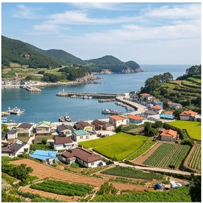

# 🌊 중부해안 (Central Coastal) — Cwa

## 기후 분류
- **쾨펜 분류**: **Cwa** (온대 동계건조 고온형)
- **연평균 기온**: 12.8°C · **강수**: 1,150mm · **무상일수**: 195일
- **대표 지역**: 인천, 강릉, 속초, 태안, 서산

## 기상 특성 ([KMA](https://data.kma.go.kr))
- **해양성 완충**: 내륙 대비 연교차 5~8°C 작음. 겨울 온화, 여름 서늘
- **서해안**: 해무 빈번 (5~7월). 간석지 간척 농경지 발달
- **동해안**: 겨울 북동기류 → 대설 (강릉 연 적설 40cm+)
- **해풍**: 염해 주의. 방풍림 설치 필수

## 🏆 지역 유명 농산물
| 지역 | 특산물 |
|------|--------|
| **태안** | 대파, 마늘 (서해안 해풍 + 사양토) |
| **강릉** | 감자, 옥수수 (영동 해안) |
| **서산** | 마늘, 생강 (간척지) |
| **보령** | 고구마 (해안 사질토) |

## 추천 작물
대파(3~4월), 배추(8월), 딸기(시설, 9월 정식)

## 참고
1. [기상청 기후자료](https://data.kma.go.kr)
