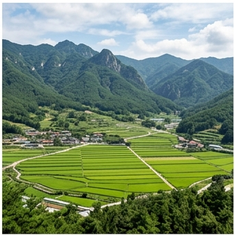

# 🌍 중부내륙 (Central Inland) — Dwa

## 기후 분류
- **쾨펜 분류**: **Dwa** (냉대 동계건조 고온형) ([Kottek et al., 2006](https://doi.org/10.1127/0941-2948/2006/0130))
- **연평균 기온**: 12.0°C · **연간 강수량**: 1,300mm (여름 집중형)
- **무상일수**: 185일 · **연간 일조**: 2,350시간
- **대표 지역**: 서울, 수원, 이천, 충주, 청주

## 월별 기상 ([KMA 1991-2020 평년값](https://data.kma.go.kr))
| 월 | 평균°C | 최고 | 최저 | 강수mm | 일조h |
|----|--------|------|------|--------|-------|
| 1 | -1.5 | 3.5 | -6.0 | 17 | 5.5 |
| 4 | 13.0 | 19.5 | 7.0 | 55 | 7.0 |
| 7 | 25.5 | 29.5 | 22.5 | **350** | 4.5 |
| 8 | 26.5 | 30.5 | 23.5 | **320** | 5.0 |
| 10 | 14.8 | 20.5 | 9.5 | 45 | 6.5 |

## 기상 특성
- **대륙성 기후**: 연교차 30°C+ (1월 -6°C → 8월 +26°C)
- **장마**: 6월 하순~7월 (약 30일간, 연 강수의 50~60% 집중)
- **서리**: 11월 초~3월 하순. 4월 늦서리 주의 (사과 화기 동해)
- **폭염**: 7~8월 일최고 33°C+ 일수 약 12일/년 (증가 추세)

## 🏆 지역 유명 농산물
| 지역 | 특산물 | 근거 |
|------|--------|------|
| **이천** | 쌀 (임금님표) | 복하천 충적양토 + 조선 진상미 |
| **충주** | 사과 | 내륙 분지 일교차 13°C |
| **안성** | 포도 (캠벨얼리) | 전통 산지 |
| **여주** | 고구마, 쌀 | 남한강 유역 사양토 |
| **청주** | 사과, 감자(봄) | 중부 과수 확대 지역 |

## 추천 작물
벼(4~5월), 고추(5월 정식), 배추(8월), 사과, 포도(3월)

## 참고
1. [기상청(KMA) 기후자료](https://data.kma.go.kr)
2. Kottek, M. et al. (2006). [World Map of Köppen-Geiger](https://doi.org/10.1127/0941-2948/2006/0130). *Meteorologische Zeitschrift*.
