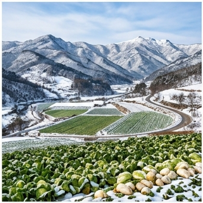

# 🏔️ 고냉지 (Highland) — Dfb

## 기후 분류
- **쾨펜 분류**: **Dfb** (냉대 습윤 온난형)
- **연평균 기온**: 8.5°C · **강수**: 1,500mm · **무상일수**: 150일
- **해발 고도**: 600~1,000m · **대표 지역**: 대관령, 평창, 태백

## 기상 특성 ([KMA 대관령관측소](https://data.kma.go.kr))
| 월 | 평균°C | 최고 | 최저 | 강수mm |
|----|--------|------|------|--------|
| 1 | -5.5 | -0.5 | -10.5 | 30 |
| 7 | 20.5 | 24.5 | 17.5 | **350** |
| 8 | 20.5 | 24.5 | 17.5 | **330** |

- **냉량 기후**: 여름 평균 20°C → 감자 괴경비대·배추 결구 최적
- **서리**: 10월 초~4월. 무상일수 겨우 150일
- **큰 일교차**: 여름에도 야간 15°C → 당 축적 유리
- **적설**: 연 적설량 200cm+ (대관령)

## 🏆 지역 유명 농산물
| 지역 | 특산물 | 근거 |
|------|--------|------|
| **대관령** | 감자, 배추 | 야간 15°C → 괴경비대·결구 최적 ([강원도농업기술원](https://www.gwd.go.kr/ares)) |
| **평창** | 씨감자 | 진딧물 밀도 낮아 바이러스 프리 (Seed potato production) |
| **태백** | 시금치, 여름배추 | 고냉지 채소 비수기 출하 |
| **정선** | 황기, 약용작물 | 산지 약용작물 특화 |

> 🔑 **고냉지 농업의 경제적 가치**: 여름 채소(배추·감자)를 비수기에 출하 → 평지 대비 **1.5~3배** 가격 프리미엄

## 추천 작물
감자(4~5월), 배추(6~7월), 사과(3월 — 온난화로 확대 중)

## 참고
1. [기상청 대관령관측소 기후자료](https://data.kma.go.kr)
2. [강원도농업기술원](https://www.gwd.go.kr/ares)
