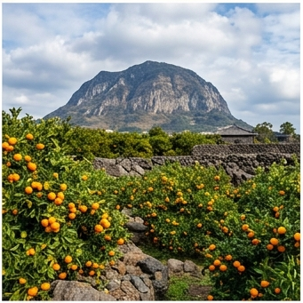

# 🌴 제주 (Jeju) — Cfa

## 기후 분류
- **쾨펜 분류**: **Cfa** (온대 습윤 고온형)
- **연평균 기온**: **15.8°C** (전국 최고) · **강수**: 1,600mm · **무상일수**: 250일
- **대표 지역**: 제주시, 서귀포시

## 기상 특성 ([KMA 제주지방기상청](https://data.kma.go.kr))
- **아열대 영향**: 전국 유일 감귤·한라봉·망고·바나나 재배 가능
- **화산 지질**: **화산회토(Andisol)** — 한국 유일 분포. 인산 고정력 높으나 보수력 우수
- **태풍 직접 경로**: 연 **2.5회** (전국 최다). 풍속 40m/s+ 빈번
- **겨울 온화**: 1월 평균 5.5°C. 서리 거의 없음
- **높은 강수**: 한라산 남사면 연 1,800mm+ (지형성 강수)

## 🏆 지역 유명 농산물
| 지역 | 특산물 | 근거 |
|------|--------|------|
| **서귀포** | 감귤, 한라봉 | 아열대, 화산회토. 연 생산 60만톤+ |
| **제주 동부** | 당근 | 화산회토 배수 우수, 전국 1위 |
| **한림** | 감자 (봄) | 전국 최조기 수확 (3~4월) |
| **성산** | 마늘 | 해양성 기후 |

> 🌡️ **아열대화**: 제주는 한국에서 기후변화 영향이 가장 빠른 지역. 망고·패션프루트 등 열대 작물 시험재배 확대 중 ([제주도농업기술원](https://www.jeju.go.kr/ares))

## 추천 작물
고구마(4~5월), 감자(1~2월 봄), 벼(4월)

## 참고
1. [기상청 제주지방기상청](https://data.kma.go.kr)
2. [제주특별자치도 농업기술원](https://www.jeju.go.kr/ares)
