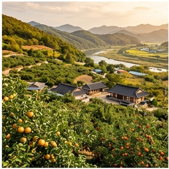

# 🌤️ 남부내륙 (South Inland) — Cwa

## 기후 개요
연평균 13.5°C · 강수 1,200mm · 무상일수 205일  
대표: 대구, 안동, 전주, 광주

## 🏆 지역 유명 농산물
| 지역 | 특산물 | 근거 |
|------|--------|------|
| **청송** | 사과 | 해발 300m+ 일교차 14°C, 지리적표시 |
| **영양** | 고추 | 산간 냉량, 캡사이신·ASTA 최고 |
| **영동** | 포도 | 내륙 분지 일교차 12°C |
| **안동** | 고추, 참외 | 하회마을 인근 충적양토 |
| **논산** | 딸기 | 설향 품종 발원지, 전국 1위 |
| **나주** | 배 | 영산강 유역 충적양토 |
| **김제** | 쌀 | 만경평야, 한국 최대 곡창 |

## 특성
- **대구 분지효과**: 폭염일수 전국 최다 (18~25일/년)
- **큰 일교차**: 과수 착색 유리
- 태풍 직접 영향 연 1.5회

## 추천 작물
벼(4~5월), 고추(4~5월), 포도(3월), 딸기(9월), 고구마(4~6월)
