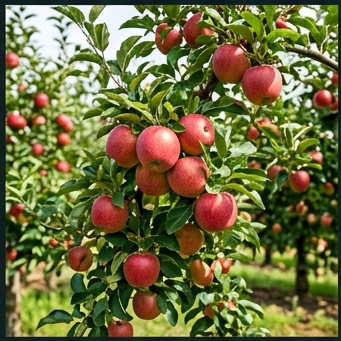

# 🍎 사과 (Apple, *Malus domestica* Borkh.)

## 분류
- **과**: 장미과 (Rosaceae) · **속**: 사과속 (*Malus*)
- **카테고리**: 과수 (낙엽 다년생, C₃) · **배수체**: 2n = 34
- **원산지**: 중앙아시아 카자흐스탄 텐샨산맥 ([Vavilov, 1926](https://doi.org/10.1007/978-94-009-6132-4))
- **한국 주요 품종**: 후지(부사) 65%, 홍로 15%, 감홍, 루비에스

## 생산 현황 ([통계청, 2024](https://kosis.kr))
| 항목 | 값 |
|------|------|
| 재배면적 | 약 3.3만 ha |
| 평균 수량 | **2,200 kg/10a** |
| HI | 0.45 · RUE 1.6 g/MJ |

---

## 🏆 지역별 유명 산지

| 지역 | 특징 |
|------|------|
| **청송** (경북) | "청송사과" [지리적표시 등록](https://www.naqs.go.kr). 해발 250~450m, 일교차 14°C |
| **영주** (경북) | 풍기 사과, 소백산 기슭 냉량 기후 |
| **충주·제천** (충북) | 충북 사과벨트, 내륙 분지 → 착색 우수 |
| **거창** (경남) | 남부 고산지 사과, 해발 300m+ 재배 확대중 |
| **장수** (전북) | 전북 유일 사과 산지, 진안고원 냉량 기후 |

> 🌡️ **온난화 영향**: 사과 재배 적지 북상·고산화 진행 중. 대구(1970년대 주산지) → 현재 청송·영주·충주. [기상청 시나리오](https://www.climate.go.kr): 2050년 강원도가 주산지.

### 📋 실제 농사 사례
> **청송 부사 사과** (2023)  
> 해발 350m, 산악갈색토. 3월 발아 → 11월 5일 수확.  
> 일교차 평균 13.5°C → 착색률 **92%**, Brix 15.8. S등급.  
> 핵심: 9월 반사필름 설치 → 과실 하부 착색 30% 향상.

---

## 생육 모델

| 생육단계 | GDD | 기간 | 생리학적 설명 |
|----------|-----|------|-------------|
| 발아기 | 120°C·일 | 10~20일 | 저온요구 충족 후 화아·엽아 전개 |
| 엽신장기 | 300°C·일 | 20~35일 | 엽면적 확보, LAI 3~5 |
| 개화기 | 150°C·일 | 7~14일 | 꽃잎 개방, 곤충 수분. **개화기 서리 = 가장 큰 위험** |
| 과실비대기 | 800°C·일 | 60~90일 | 세포분열→세포비대. June drop 후 과실 급증 |
| 착색성숙기 | 500°C·일 | 30~50일 | 안토시아닌 생성, 전분→당 전환, 향기 발달 |

- **기본온도**: 7°C · **총 GDD**: 2,000°C·일
- **저온요구량**: **1,000시간** (7°C 이하, [Richardson et al., 1974](https://doi.org/10.21273/JASHS.99.5.399))

---

## 환경 요구

### 온도
| 항목 | 값 | 근거 |
|------|------|------|
| 최적 주간/야간 | 22/13°C | 광합성↑, 착색↑ |
| 착색 최적 야간 | **10~15°C** | 안토시아닌 합성 효소(UFGalT) 활성 최대 |
| 치사 저온 (휴면) | -30°C | 내한성 강함 (낙엽 후) |
| 개화기 저온 위험 | **-2°C** | 늦서리 → 화기 동해, 착과율 급감 |
| 치사 고온 | 40°C | 일소과, 엽소 |

> ⚠️ **4월 늦서리**: 사과 최대 위험 요인. 방상팬·스프링클러 방상 기술 필수 ([NIAS, 2023](https://www.nias.go.kr))

### 양분
- **NPK**: 6:4:6 · N 과다 → 착색 불량, 저장성 저하
- 칼슘(Ca) 시비 → 고두병(bitter pit) 예방

### 병해
| 병해 | 병원체 | 트리거 | 일 피해 |
|------|--------|--------|---------|
| 화상병 | *Erwinia amylovora* | 18~28°C, RH≥70% | 6% |
| 검은별무늬병 | *Venturia inaequalis* | 10~25°C, RH≥80% | 4% |
| 탄저병 | *Glomerella cingulata* | 25~30°C, RH≥85% | 3% |

> **화상병**: 2015년 한국 첫 발생 이후 안성·충주 등 확산. 법정 전염병으로 지정, 발생 과원 전면 매몰 ([농림축산검역본부](https://www.qia.go.kr))

---

## 참고 문헌
1. Richardson, E.A. et al. (1974). [A model for estimating chill units](https://doi.org/10.21273/JASHS.99.5.399). *HortScience*, 9(5).
2. Vavilov, N.I. (1926). [Centers of origin of cultivated plants](https://doi.org/10.1007/978-94-009-6132-4).
3. 농촌진흥청 (2024). [사과 재배매뉴얼](https://www.nongsaro.go.kr). 농사로.
4. 기상청 (2023). [기후변화에 따른 과수 재배적지 변동](https://www.climate.go.kr).