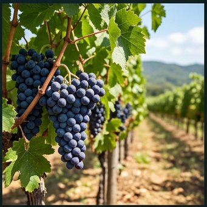

# 🍇 포도 (Grape, *Vitis vinifera* L.)

## 분류
- **과**: 포도과 (Vitaceae) · **속**: 포도속 (*Vitis*)
- **카테고리**: 과수 (다년생 덩굴, C₃) · **기원**: 코카서스~서아시아 ([McGovern, 2003](https://doi.org/10.1515/9781400849536))
- **한국 주요 품종**: 캠벨얼리(1908년 도입), 거봉, MBA, **샤인머스캣**(2006년~)

## 생산 현황 ([통계청, 2024](https://kosis.kr))
| 항목 | 값 |
|------|------|
| 재배면적 | 약 1.2만 ha |
| 평균 수량 | **1,500 kg/10a** |
| HI | 0.40 · RUE 1.5 g/MJ |

---

## 🏆 지역별 유명 산지

| 지역 | 특징 |
|------|------|
| **영동** (충북) | 한국 포도 수도. 내륙 분지 일교차 12°C → 당도 극대화. [영동포도축제](https://www.yd21.go.kr) |
| **김천** (경북) | 샤인머스캣 전국 1위 생산량 (2023) |
| **상주** (경북) | 거봉 포도 특구. 사양토 배수 우수 |
| **천안** (충남) | 거봉 특산지, 수도권 출하 유리 |
| **안성** (경기) | 캠벨얼리 전통 산지 |

### 📋 실제 농사 사례
> **영동 샤인머스캣** (2023, [충북농업기술원](https://www.chungbuk.go.kr/ares))  
> 연동 비닐하우스 1,500평. 3월 발아 → 9월 20일 수확.  
> 비가림 재배로 잿빛곰팡이병 90% 억제.  
> Brix **19.2**, 과립중 12.8g. kg당 **12,000원**.  
> 핵심: 과실비대기 **일교차 10°C+** 유지 (야간 측창 개방).

---

## 생육 모델

| 생육단계 | GDD | 기간 | 생리학적 설명 |
|----------|-----|------|-------------|
| 발아기 | 100°C·일 | 10~20일 | 저온요구 충족 후 눈 해제, 수액 이동 |
| 신초생장기 | 400°C·일 | 30~45일 | 덩굴 급신장, 엽면적 확보. LAI 4~6 |
| 개화기 | 200°C·일 | 10~15일 | 꽃 개방, 자가수분. 개화기 강우 → 결실불량 |
| 과실비대기 | 500°C·일 | 40~60일 | 세포분열 → 세포비대. 수분·양분 집중 |
| 착색성숙기 (Véraison) | 400°C·일 | 30~45일 | **안토시아닌 합성**, 당도 급증, 산도 감소 |

- **기본온도**: 10°C · **총 GDD**: 1,800°C·일
- **저온요구량**: 750~1,200 시간 (7°C 이하, 품종에 따라 상이)

---

## 환경 요구

### 온도 ([Kliewer, 1977](https://doi.org/10.2134/agronj1977.00021962006900040056x))
| 항목 | 값 |
|------|------|
| 최적 주간/야간 | 25/15°C |
| 착색 최적 야간 | **13~18°C** (안토시아닌 합성 촉진) |
| 치사 저온 | -20°C (겨울, 휴면기) · -2°C (발아 후) |
| 치사 고온 | 42°C (엽소, 일소과) |

> 🔑 **일교차 효과**: 야간 저온(15°C 이하)에서 당 호흡 감소 → 과실 당도 15~25% 증가. 이것이 영동·김천 등 내륙 분지가 명산지인 이유.

### 수분
- 총 필요: 600~800mm · Kc: 0.4→0.85→0.45
- **과실비대기 수분 결핍**: Brix↑ 이나 과립 소형화 → 품질 vs 수량 trade-off
- 착색기 과습 → 열과(裂果), 잿빛곰팡이병

### 양분 ([농촌진흥청](https://www.nongsaro.go.kr))
- **NPK**: 5:3:8 (K 매우 높음) · K → 착색 촉진, 당 전류
- N 과다 → 착색 불량, 도장지 발생

### 병해
| 병해 | 병원체 | 트리거 | 일 피해 |
|------|--------|--------|---------|
| 잿빛곰팡이병 | *Botrytis cinerea* | 15~25°C, RH≥85% | 5% |
| 흰가루병 | *Erysiphe necator* | 20~30°C, RH≥60% | 3% |
| 탄저병 | *Colletotrichum* | 25~35°C, RH≥85% | 4% |

---

## 참고 문헌
1. Kliewer, W.M. (1977). [Influence of temperature on composition of grapes](https://doi.org/10.2134/agronj1977.00021962006900040056x). *Am. J. Enol. Vitic.*
2. McGovern, P.E. (2003). *[Ancient Wine](https://doi.org/10.1515/9781400849536)*. Princeton University Press.
3. 농촌진흥청 (2024). [포도 재배매뉴얼](https://www.nongsaro.go.kr). 농사로.