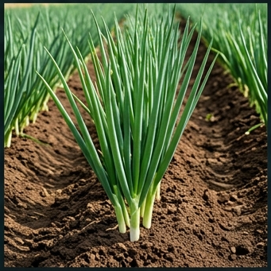

# 🧅 대파 (Green Onion, *Allium fistulosum* L.)

## 분류
- **과**: 백합과 (Liliaceae → 현재 부추과 Amaryllidaceae) · **속**: 부추속 (*Allium*)
- **카테고리**: 채소 (C₃) · **원산지**: 시베리아~중국 서부 ([Hanelt, 1990](https://doi.org/10.1007/978-3-662-09612-3))
- **특성**: 비늘줄기가 없는 파속 식물. 연속 수확 가능한 다년생

## 생산 현황
| 항목 | 값 |
|------|------|
| 전국 재배면적 | 약 2.1만 ha ([통계청, 2024](https://kosis.kr)) |
| 평균 수량 | **4,000 kg/10a** |
| HI | 0.65 · RUE 1.8 g/MJ |

---

## 🏆 지역별 유명 산지

| 지역 | 특징 |
|------|------|
| **이천·여주** (경기) | 봄대파 주산지, 충적양토. 수도권 직거래 |
| **신안·무안** (전남) | 가을·월동파 전국 1위. 해양성 기후 겨울 온화(-3°C까지) |
| **창녕** (경남) | 남부 대파 특산지 |

### 📋 실제 농사 사례
> **신안 월동파** (2023)  
> 사양토, 9월 파종 → 이듬해 4월 수확.  
> 해양성 기후로 겨울 최저 -3°C (내한성 범위).  
> 엽초 길이 42cm, 수량 4,200 kg/10a.  
> 핵심: **북주기(培土)** 3회 실시 → 연백부(흰 부분) 25cm 확보.

---

## 생육 모델

| 생육단계 | GDD | 기간 | 설명 |
|----------|-----|------|------|
| 발아기 | 50°C·일 | 7~14일 | 종자 출아, 15~25°C 최적 |
| 유묘기 | 200°C·일 | 20~30일 | 1~3엽기, 연약한 유묘 |
| 엽초생장기 | 800°C·일 | 60~90일 | 엽초(연백부) 급신장. 북주기로 연백 연장 |
| 엽신장기 | 600°C·일 | 40~60일 | 엽수·엽장 증가, 수확 적기 |
| 추대기 | 400°C·일 | 20~30일 | 저온 감응 후 화경 출현 → 수확 종료 |

- **기본온도**: 4°C · **총 GDD**: 2,100°C·일

---

## 환경 요구

### 온도
| 항목 | 값 |
|------|------|
| 최적 주간/야간 | **18/12°C** |
| 치사 저온 | **-5°C** (내한성 비교적 강) |
| 추대 유발 | 5~12°C에서 30일 이상 감응 후 장일(14h+) → 추대 |

### 양분
- **NPK**: 12:4:6 (N 중심) · N 24, P₂O₅ 7, K₂O 12 kg/10a
- 수분: 500~700mm · pH 6.0~7.0
- 적합 토양: 사양토, 충적양토 (배수 양호)

### 병해
| 병해 | 병원체 | 트리거 | 일 피해 |
|------|--------|--------|---------|
| 녹병 | *Puccinia allii* | 15~25°C, RH≥70% | 4% |
| 검은무늬병 | *Stemphylium* | 20~30°C, RH≥80% | 3% |

---

## 참고 문헌
1. Hanelt, P. (1990). [Taxonomy of the genus Allium](https://doi.org/10.1007/978-3-662-09612-3). In *Allium Crop Science*.
2. 농촌진흥청 (2024). [대파 재배매뉴얼](https://www.nongsaro.go.kr). 농사로.
