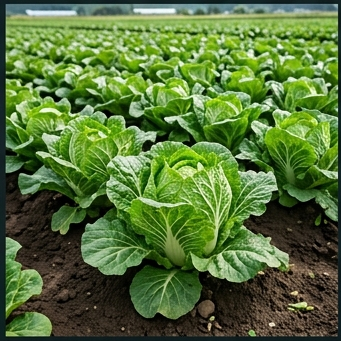

# 🥬 배추 (Napa Cabbage, *Brassica rapa* subsp. *pekinensis*)

## 분류
- **과**: 십자화과 (Brassicaceae) · **속**: 배추속 (*Brassica*)
- **카테고리**: 채소 (C₃) · **김장 배추** = 한국 농업의 핵심 작물
- **원산지**: 중국 북부 ([Prakash et al., 2009](https://doi.org/10.1007/978-3-540-74860-7_1))

## 생산 현황 ([통계청, 2024](https://kosis.kr))
| 항목 | 값 |
|------|------|
| 재배면적 | 약 3.5만 ha |
| 평균 수량 | **8,000 kg/10a** |
| HI | 0.75 · RUE 2.0 g/MJ |

---

## 🏆 지역별 유명 산지

| 지역 | 특징 |
|------|------|
| **해남** (전남) | 가을·겨울배추 전국 1위. 해양성 온난 기후 + 황토. [해남군 농업기술센터](https://www.haenam.go.kr) |
| **대관령** (강원) | 여름 고냉지배추 대표. 7~9월 비수기 프리미엄 |
| **평창** (강원) | 고냉지배추, 해발 600m+ |
| **괴산** (충북) | 절임배추 특구, 가을배추 |

### 📋 실제 농사 사례
> **해남 김장배추** (2023)  
> 식양토, 8월 15일 파종 → 11월 20일 수확.  
> 결구기 기온 15°C 전후 최적. 결구중 **3.2kg/포기**.  
> 수량 8,500 kg/10a. 핵심: 결구기 N 추비 10kg/10a.

> **대관령 여름배추** (2022, [강원도농업기술원](https://www.gwd.go.kr/ares))  
> 산악갈색토 유효토심 50cm. 6월 정식 → 9월 수확.  
> 평균기온 19°C (냉량 최적). 무름병 발생 없음.  
> 수량 7,200 kg/10a. kg당 **800원** (여름 프리미엄).

---

## 생육 모델

| 생육단계 | GDD | 기간 | 설명 |
|----------|-----|------|------|
| 발아기 | 60°C·일 | 3~7일 | 파종 후 출아, 25°C 최적 |
| 유묘기 | 150°C·일 | 10~18일 | 쌍엽~본엽 3매, 정식 적기 판단 |
| 외엽생장기 | 400°C·일 | 20~30일 | 외부 잎 급신장, 광합성 기반 확보 |
| 결구기 | 500°C·일 | 25~40일 | **핵심 단계**: 내부 잎이 안쪽으로 감기며 결구 형성 |
| 수확적기 | — | 7~14일 | 결구 상부 눌렀을 때 단단하면 수확 |

- **기본온도**: 4°C · **총 GDD**: 1,400°C·일
- **결구 생리**: 외엽 광합성 산물이 내엽으로 전류, 내엽의 세포분열·비대로 결구 형성

---

## 환경 요구

### 온도 — 냉량 선호 작물
| 항목 | 값 |
|------|------|
| 최적 주간/야간 | **18/10°C** |
| 결구 최적 | 15~20°C (야간 5~10°C) |
| 치사 저온 | -8°C (내한성 비교적 강) |
| **치사 고온** | **35°C** (고온에 매우 약함 — 추대, 석회결핍증) |

> ⚠️ **고온 장해**: 25°C 이상 지속 시 결구 불량, **추대(bolting)** 발생. 이것이 여름배추가 고냉지에서만 가능한 이유.

### 양분 ([농촌진흥청](https://www.nongsaro.go.kr))
- **NPK**: 16:4:10 · N 32, P₂O₅ 7.8, K₂O 19.6 kg/10a
- 붕소(B) 결핍 → 속썩음병 유발. 붕산 1kg/10a 엽면시비

### 병해
| 병해 | 병원체 | 트리거 | 일 피해 |
|------|--------|--------|---------|
| 무름병 | *Pectobacterium carotovorum* | 22~35°C, RH≥80% | **6%** |
| 뿌리혹병 | *Plasmodiophora brassicae* | 18~25°C, 산성토양 | 5% |
| 노균병 | *Hyaloperonospora* | 10~20°C, RH≥85% | 3% |

> **뿌리혹병**: 토양 pH 5.5 이하에서 급증. **석회 시용으로 pH 6.5+** 교정이 최선 방제. 연작 회피 7년 권장.

---

## 참고 문헌
1. Prakash, S. et al. (2009). [Brassica and its close allies](https://doi.org/10.1007/978-3-540-74860-7_1).
2. 농촌진흥청 (2024). [배추 재배매뉴얼](https://www.nongsaro.go.kr). 농사로.
