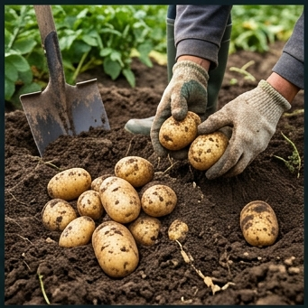

# 🥔 감자 (Potato, *Solanum tuberosum* L.)

## 분류
- **과**: 가지과 (Solanaceae) · **속**: 가지속 (*Solanum*)
- **카테고리**: 근채류 (C₃ 광합성) · **배수체**: 4n = 48 (이질4배체)
- **원산지**: 남미 안데스 고원 (해발 3,000~4,000m, [Spooner et al., 2005](https://doi.org/10.1073/pnas.0507400102))
- **한국 도입**: 1824년 (순조 24년), 만주 간도 경유 ([농진청](https://www.rda.go.kr))

## 생산 현황 ([통계청 KOSIS, 2024](https://kosis.kr))
| 항목 | 값 |
|------|------|
| 전국 평균 수량 | **2,800 kg/10a** |
| 잠재 수량 | 3,500 kg/10a |
| 수확지수(HI) | **0.75** (전체 DM 중 괴경 비율) |
| 방사이용효율(RUE) | 2.3 g/MJ |
| 주요 품종 | 수미(Superior), 대지(Dejima), 금선 |

---

## 🏆 지역별 유명 산지

| 지역 | 특징 | 비고 |
|------|------|------|
| **대관령** (강원) | 한국 고냉지 감자의 수도. 해발 700m, 여름 야간 15°C → 괴경 비대 최적 | [강원도농업기술원](https://www.gwd.go.kr/ares) |
| **평창** (강원) | 씨감자 생산 1위. 고냉지 진딧물 밀도 낮아 바이러스 프리 |
| **횡성** (강원) | 남부 고냉지 감자, 전분 함량 높음 (18%+) |
| **제주** (제주) | 봄감자 전국 최조기 출하 (2~3월). 화산회토 배수 우수 |
| **보성** (전남) | 남부 봄감자, 해양성 기후 활용 조기 재배 |

### 📋 실제 농사 사례
> **대관령 여름감자** (2023, [강원도농업기술원 보고](https://www.gwd.go.kr/ares))  
> 수미(Superior) 품종, 해발 750m 산악갈색토.  
> 4월 25일 파종 → 8월 20일 수확 (118일).  
> 여름 평균기온 20.2°C, **야간 14.8°C** (괴경비대 최적).  
> 수량 **3,200 kg/10a**, 전분율 18.2%.  
> 핵심: 괴경비대기 토양수분 FC 70% 유지 → 중심공동 발생 제로.

> **제주 봄감자** (2022)  
> 대지(Dejima) 품종, 화산회토. 1월 파종 → 5월 수확.  
> 비닐멀칭 + 터널피복으로 서리 피해 방지.  
> 수량 2,500 kg/10a. 전국 최조기 출하로 **kg당 1,800원** 프리미엄.

---

## 생육 모델 ([DSSAT SUBSTOR-Potato](https://dssat.net/))

| 생육단계 | GDD | 기간 | 생리학적 설명 |
|----------|-----|------|-------------|
| 발아출현기 | 100°C·일 | 10~20일 | 씨감자 맹아 신장, 토양 온도 7°C+ 필요 |
| 경엽생장기 | 400°C·일 | 20~35일 | 줄기·엽 급신장, LAI 3~5. 광합성 기반 구축 |
| 개화기 | 200°C·일 | 10~15일 | 개화(장식), 지하 stolon 말단 비대 시작 |
| 괴경비대기 | 500°C·일 | 30~45일 | **핵심: 전분 축적**. 야간 12~15°C에서 최대 |
| 성숙기 | 200°C·일 | 10~20일 | 경엽 황화, 괴경 표피 코르크화, 수확 가능 |

- **기본온도**: 4°C · **총 GDD**: 1,600°C·일
- **괴경 비대의 온도 생리**: GA(지베렐린) 억제 + 투베론산(tuberonic acid) 생성이 야간 저온(12~15°C)에서 촉진 ([Ewing, 1997](https://doi.org/10.1079/9780851991405.0295))

---

## 환경 요구조건

### 온도
| 항목 | 값 | 근거 |
|------|------|------|
| 최적 주간/야간 | **22/12°C** | 주간 광합성↑, 야간 호흡↓ + 괴경비대 촉진 |
| 경엽 최적 | 25~30°C | 초기 경엽 성장기 |
| 괴경비대 최적 | **15~18°C** (토양) | 야간 기온 12~15°C 시 괴경 비대율 최대 |
| 치사 저온 | **-2°C** | 경상해. -4°C 이하 경엽 완전 동사 |
| 치사 고온 | 35°C | 괴경 비대 거의 정지, 내부 갈변 발생 |

> ⚠️ **야간 고온(>20°C) 장해**: 호흡량 증가 → 순 광합성 산물 축적 감소 → 괴경 비대 40~70% 억제 ([Levy & Veilleux, 2007](https://doi.org/10.1007/s12230-007-9016-2))

### 수분 ([FAO-56](https://www.fao.org/3/x0490e/x0490e00.htm))
| 항목 | 값 |
|------|------|
| 총 필요 | 400~600mm |
| Kc 계수 | 0.5(초기)→1.15(개화~비대)→0.75(성숙) |
| 가뭄 감수성 | 0.7 (높음 — 특히 개화~비대기) |
| 과습 내성 | 낮음 (토양 포화 48h 이상 → 괴경 부패) |

### 양분 ([농촌진흥청](https://www.nongsaro.go.kr))
| 성분 | 시비량 | 역할 |
|------|--------|------|
| N | 6~10 kg/10a | 경엽 성장 (과다 → 괴경비대 지연) |
| P₂O₅ | 6~8 kg/10a | 뿌리 발달, 괴경 initiation |
| K₂O | **8~12 kg/10a** | **전분 축적, 저장성 향상** (K 중시) |

> **NPK 비율**: 5:5:6 — 칼리(K) 비중이 높은 것이 특징

### 토양 적합도
| 토양 | 적합도 | 이유 |
|------|--------|------|
| 사양토 | ★★★★★ | 배수↑, 괴경 비대 용이, 수확 쉬움 |
| 산악갈색토 | ★★★★☆ | 고냉지 냉량기후와 결합, 유기물↑ |
| 화산회토 | ★★★★☆ | 배수↑, 보수력 적절 (제주 봄감자) |
| 충적양토 | ★★★☆☆ | 가능하나 과습 주의 |
| 논토양 | ★☆☆☆☆ | 배수 불량 → 괴경 부패 |

---

## 병해충 모델

| 병해 | 병원체 | 트리거 조건 | 일 피해율 | 감수성 시기 |
|------|--------|-----------|---------|-----------|
| **감자역병** | *Phytophthora infestans* | 12~22°C, RH≥85%, 질소과다 | **7%** | 개화~비대기 |
| 더뎅이병 | *Streptomyces scabies* | 18~28°C, 건조(RH 40~65%) | 3% | 괴경비대기 |
| 풋마름병 | *Ralstonia solanacearum* | 25~35°C, 과습 | 5% | 전 생육기 |

> **역사**: 1845년 아일랜드 대기근 — 감자역병(*P. infestans*)에 의한 감자 전멸로 100만명 사망, 100만명 이민. 현재도 전 세계 감자 최대 병해. ([Fry, 2008](https://doi.org/10.1146/annurev-phyto-080508-081932))

---

## 재배력
| 구역 | 파종 | 수확 | 비고 |
|------|------|------|------|
| 중부내륙 | 3~4월 | 6~7월 | 봄감자 |
| **고냉지** | **4~5월** | **8~9월** | 여름감자 (고품질) |
| 남부 | 2~3월 | 5~6월 | 봄감자 조기 |
| 제주 | 1~2월 | 4~5월 | 최조기 재배 |

---

## 참고 문헌
1. Ewing, E.E. (1997). [Potato dormancy and tuberization](https://doi.org/10.1079/9780851991405.0295). *The Physiology of Vegetable Crops*.
2. Spooner, D.M. et al. (2005). [A single domestication for potato](https://doi.org/10.1073/pnas.0507400102). *PNAS*, 102(41).
3. Kooman, P.L. & Haverkort, A.J. (1995). *[Potato Ecology and Modelling](https://doi.org/10.1007/978-94-011-0051-9)*.
4. Levy, D. & Veilleux, R.E. (2007). [Adaptation of potato to high temperatures](https://doi.org/10.1007/s12230-007-9016-2). *Am. J. Potato Res.*
5. Fry, W.E. (2008). [*Phytophthora infestans*](https://doi.org/10.1146/annurev-phyto-080508-081932). *Annu. Rev. Phytopathol.*
6. 농촌진흥청 (2024). [감자 재배매뉴얼](https://www.nongsaro.go.kr). 농사로.
7. FAO (1998). [Crop evapotranspiration (FAO-56)](https://www.fao.org/3/x0490e/x0490e00.htm).
