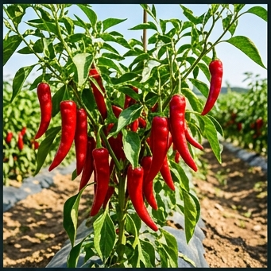

# 🌶️ 고추 (Red Pepper, *Capsicum annuum* L.)

## 분류
- **과**: 가지과 (Solanaceae) · **속**: 고추속 (*Capsicum*)
- **카테고리**: 채소/양념 (C₃) · **원산지**: 중남미 ([Perry et al., 2007](https://doi.org/10.1126/science.1136914))
- **한국 도입**: 16세기 말 임진왜란 전후 ([NIHHS](https://www.nihhs.go.kr))
- **활성 성분**: 캡사이신(capsaicin) — SHU(Scoville Heat Units)로 매운맛 정량

## 생산 현황 ([통계청, 2024](https://kosis.kr))
| 항목 | 값 |
|------|------|
| 재배면적 | 약 3.1만 ha |
| 건고추 평균 수량 | **250 kg/10a** |
| HI | 0.35 · RUE 1.8 g/MJ |
| 한국인 연간 소비 | 약 4kg/인 (건고추 기준, [aT](https://www.at.or.kr)) |

---

## 🏆 지역별 유명 산지

| 지역 | 특징 |
|------|------|
| **영양** (경북) | "영양고추" [지리적표시](https://www.naqs.go.kr). 일교차 大 → 캡사이신·ASTA 색도 최고 |
| **임실** (전북) | 임실고추, 산간 냉량 기후, 건고추 명품화 |
| **괴산** (충북) | 청결고추 브랜드, 건조기술 선도 |
| **봉화** (경북) | 태백산맥 기슭, 병해 적은 청정 산지 |
| **안동** (경북) | 전통 산지, 하회마을 인근 충적양토 |

### 📋 실제 농사 사례
> **영양 건고추** (2023, [경북농업기술원](https://www.gba.go.kr))  
> 노지 재배 2,000평, 충적양토. 5월 1일 정식 → 8~9월 수확.  
> 7월 장마기 역병 발생 → 배수로 정비 + 동 살균제로 확산 방지.  
> 건고추 수량 **270 kg/10a**, ASTA 130, 캡사이신 0.35%.  
> kg당 **15,000원** (특등급). 핵심: 이랑 높이 30cm → 배수 개선.

---

## 생육 모델

| 생육단계 | GDD | 기간 | 설명 |
|----------|-----|------|------|
| 발아기 | 120°C·일 | 10~18일 | 25~30°C 최적 발아온도 |
| 유묘기 | 300°C·일 | 25~40일 | 본엽 5~8매 시 정식 적기 |
| 영양생장기 | 500°C·일 | 30~45일 | 분지 발달, 엽면적 확보 |
| 개화착과기 | 400°C·일 | 20~30일 | 연속 개화·착과. 착과 부하 조절 중요 |
| 과실비대기 | 600°C·일 | 30~50일 | 과실 급비대, 캡사이신 축적 |
| 착색성숙기 | 300°C·일 | 15~25일 | 엽록소 분해, 캡산틴(붉은색) 합성 |

- **기본온도**: 10°C · **총 GDD**: 2,300°C·일

---

## 환경 요구

### 온도
| 항목 | 값 |
|------|------|
| 최적 주간/야간 | **27/18°C** |
| 치사 저온 | **2°C** (저온에 매우 약함) |
| 치사 고온 | 38°C (낙화, 기형과) |
| 정식 최소 지온 | 15°C 이상 |

### 수분·양분
- 수분: 500~700mm · Kc: 0.4→1.05→0.9
- **NPK**: 8:5:6 · N 19, P₂O₅ 11, K₂O 15 kg/10a ([농촌진흥청](https://www.nongsaro.go.kr))
- pH 6.0~7.0 · 적합 토양: 충적양토, 식양토

### 병해 — 한국 고추 최대 위협
| 병해 | 병원체 | 트리거 | 일 피해 | 특기사항 |
|------|--------|--------|---------|---------|
| 탄저병 | *Colletotrichum* spp. | 25~35°C, RH≥85% | 6% | 착과~착색기 |
| **역병** | *Phytophthora capsici* | 20~30°C, RH≥90% | **7%** | 🔴 포장 전체 폐사 가능 |
| 바이러스 | TSWV, CMV | 진딧물·총채벌레 매개 | 5% | 저항성 품종 사용 |

> ⚠️ **역병**: 장마철 집중 발생. 토양 전염성으로 연작 시 피해 극심. **배수 관리가 최우선** 방제 수단. ([Lee et al., 2001](https://doi.org/10.5423/PPJ.2001.17.1.031))

---

## 참고 문헌
1. Perry, L. et al. (2007). [Starch fossils and the domestication of chili peppers](https://doi.org/10.1126/science.1136914). *Science*, 315(5814).
2. Lee, B.K. et al. (2001). [Phytophthora blight of pepper in Korea](https://doi.org/10.5423/PPJ.2001.17.1.031). *Plant Pathol. J.*
3. 농촌진흥청 (2024). [고추 재배매뉴얼](https://www.nongsaro.go.kr). 농사로.