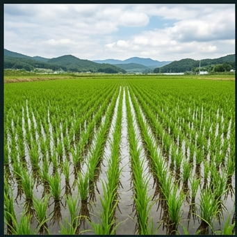

# 🌾 벼 (Rice, *Oryza sativa* L.)

## 분류
- **과**: 벼과 (Poaceae) · **속**: 벼속 (*Oryza*)
- **아종**: *japonica* (단립종, 한국형) · **카테고리**: 곡류 (C₃ 광합성)
- **원산지**: 양쯔강 유역 (약 9,000년 전 재배화, [Fuller et al., 2009](https://doi.org/10.1126/science.1166624))
- **유전체**: 2n = 24, 게놈 크기 389 Mb ([IRGSP, 2005](https://doi.org/10.1038/nature03895))

## 한국 벼 재배 현황 ([통계청 KOSIS, 2024](https://kosis.kr))
| 항목 | 값 |
|------|------|
| 재배면적 | 약 73만 ha |
| 전국 평균 수량 | **514 kg/10a** |
| 잠재 수량 | 600 kg/10a |
| 수확지수(HI) | 0.45 ([Kiniry et al., 2001](https://doi.org/10.2134/agronj2001.931131x)) |
| 방사이용효율(RUE) | 1.4 g/MJ |

---

## 🏆 지역별 유명 산지 & 브랜드

| 지역 | 브랜드 | 특징 |
|------|--------|------|
| **이천** (경기) | 임금님표 이천쌀 | 조선시대 진상미. 복하천 충적양토 + 일교차 大. [이천시농업기술센터](https://www.icheon.go.kr/farm) |
| **김제** (전북) | 지평선 쌀 | 만경평야, 한국 최대 곡창지대. 점토질 논토양 |
| **철원** (강원) | 철원 오대쌀 | DMZ 청정 지역, 화강암 풍화토, 냉량 기후 → 식미↑ |
| **당진** (충남) | 해나루 쌀 | 서해안 간척지, 염수 관리 기술 축적 |
| **예산** (충남) | 예당평야 쌀 | 예당호 관개, 미사질양토 |

### 📋 실제 농사 사례
> **이천 쌀 사례** (2023, [농촌진흥청 우수사례집](https://www.rda.go.kr))  
> 이천시 호법면 A농가, 추청(秋晴) 품종 재배. 5월 15일 이앙, 9월 25일 수확.  
> 적산온도 2,850°C·일 달성. 수량 **548 kg/10a**, 식미치 87점(상위 5%).  
> 핵심 기술: 분얼 말기 **중간낙수** 7일 실시 → 과 분얼 억제, 등숙률 92% 달성.

> **김제 만경평야 사례** (2022)  
> 신동진 품종 3,000평 재배. 논토양(회색 글라이) pH 5.8 조건.  
> 7월 장마 기간 도열병 발생 → 친환경 방제(규산칼슘 엽면시비) 적용.  
> 최종 수량 **520 kg/10a**, B등급 판정.

---

## 생육 모델 (DSSAT [CERES-Rice](https://dssat.net/) 기반)

| 생육단계 | GDD 요구량 | 기간 | 생리학적 설명 |
|----------|-----------|------|-------------|
| 발아기 (Germination) | 80°C·일 | 5~10일 | 종자 출아, 유근(幼根) 신장. 수온 12°C 이상 필요 |
| 유묘기 (Seedling) | 250°C·일 | 15~25일 | 1~3엽기, 모판 관리. LAI 0.2~0.5 |
| 분얼기 (Tillering) | 800°C·일 | 30~45일 | 분얼수 증가, LAI 급증(최대 6~8). 군락 형성 |
| 출수기 (Heading) | 400°C·일 | 10~15일 | 수잉기~출수. 화분 비산, **수정 결정 시기** |
| 등숙기 (Grain filling) | 600°C·일 | 30~45일 | 전분 축적, 수분함량 감소. 일평균 21~25°C 최적 |
| 수확적기 (Maturity) | — | 7~14일 | 수분함량 20~25%에서 수확 |

- **기본온도(T_base)**: 9°C (분얼~출수), 12°C (등숙기)
- **총 GDD**: 2,800°C·일 (파종→수확)
- **일장 감응**: 단일 식물. 일장 < 13.5h에서 출수 촉진 ([Vergara & Chang, 1985](https://doi.org/10.1007/978-94-009-5458-6_6))

---

## 환경 요구조건

### 온도 ([Yoshida, 1981](https://books.irri.org/9711040522_content.pdf))
| 항목 | 값 | 근거 |
|------|------|------|
| 최적 주간/야간 | 28/22°C | 광합성 최대, 호흡 최소 |
| 분얼 최적 | 25~31°C | 분얼수 극대화 |
| 출수기 최적 | 25~28°C | 화분 활력 유지 |
| 치사 저온 | **5°C** | 유묘기 냉해. 10°C 이하 3일 이상 시 활착 불량 |
| 치사 고온 | 42°C | 화분 불활성화 |
| 등숙 야간 최적 | 18~22°C | 야간 고온(>26°C) → 호흡량 증가, 등숙률 저하 |

> ⚠️ **출수기 고온 장해**: 일최고기온 35°C 이상 시 화분활력 급감, 등숙률 10~30% 감소 ([Kim et al., 2013](https://doi.org/10.7740/kjcs.2013.58.3.209))

### 수분 ([FAO-56 Penman-Monteith](https://www.fao.org/3/x0490e/x0490e00.htm))
| 항목 | 값 |
|------|------|
| 총 필요 수분 | 800~1,200mm |
| ETc 계수(Kc) | 0.6(유묘)→1.2(분얼~출수)→0.9(등숙) |
| 담수 관리 | 육묘~분얼기 5~7cm 담수 → 중간낙수 7일 → 등숙 후기 낙수 |
| 가뭄 감수성 | **0.8** (극히 높음 — 논 작물) |

### 양분 ([농촌진흥청 시비 기준](https://www.nongsaro.go.kr))
| 성분 | 시비량 (kg/10a) | 역할 |
|------|----------------|------|
| N | 9~15 | 분얼 촉진, 엽면적 확보 |
| P₂O₅ | 4~5 | 뿌리 발달, 출수 촉진 |
| K₂O | 5~7 | 줄기 강화, 등숙 촉진 |

> **NPK 비율**: 10:4:5 (농진청). 질소 과다 → 도복·도열병 증가

### 토양 적합도
| 토양 | 적합도 | 이유 |
|------|--------|------|
| 논토양 (Paddy Gley) | ★★★★★ | 담수에 최적화된 환원층 |
| 충적양토 | ★★★★☆ | 보수력 양호, 논 조성 가능 |
| 식양토 | ★★★★☆ | 점토 함량 높아 담수 유지 |
| 사양토 | ★★☆☆☆ | 배수 과다 → 담수 곤란 |

---

## 병해충 모델

| 병해 | 병원체 | 트리거 조건 | 일 피해율 | 감수성 시기 | 방제 |
|------|--------|-----------|---------|-----------|------|
| 도열병 | *Magnaporthe oryzae* | 20~28°C, RH≥85%, 질소과다 | 4% | 분얼·출수기 | 규산칼슘, 삼환졸계 약제 |
| 문고병 | *Rhizoctonia solani* | 25~32°C, RH≥80%, 밀식 | 3% | 분얼~등숙기 | 밀식 회피, 발리다마이신 |
| 흰잎마름병 | *Xanthomonas oryzae* | 25~30°C, 풍수해 후 | 3% | 분얼~출수기 | 저항성 품종, 동 살균제 |

> **역사적 참고**: 도열병은 전 세계 벼 수확량의 10~30%를 감소시키는 최대 병해 ([Dean et al., 2012](https://doi.org/10.1111/j.1364-3703.2012.00822.x))

---

## 재배력 (농진청 기준)
| 기후 구역 | 파종 | 이앙 | 중간낙수 | 수확 |
|-----------|------|------|---------|------|
| 중부내륙 | 4~5월 | 5~6월 | 7월 중 | 9~10월 |
| 남부내륙 | 4~5월 | 5~6월 | 7월 초 | 9~10월 |
| 남부해안 | 4월 | 5~6월 | 6월 하 | 9~10월 |

---

## 참고 문헌
1. Yoshida, S. (1981). *[Fundamentals of Rice Crop Science](https://books.irri.org/9711040522_content.pdf)*. IRRI.
2. Kiniry, J.R. et al. (2001). [Radiation-use efficiency in biomass accumulation](https://doi.org/10.2134/agronj2001.931131x). *Agronomy Journal*, 93, 131-136.
3. Kim, J. et al. (2013). [High temperature effects on rice quality](https://doi.org/10.7740/kjcs.2013.58.3.209). *Korean J. Crop Sci.*, 58(3).
4. Dean, R. et al. (2012). [The Top 10 fungal pathogens](https://doi.org/10.1111/j.1364-3703.2012.00822.x). *Molecular Plant Pathology*, 13(4).
5. 농촌진흥청 (2024). [벼 재배매뉴얼](https://www.nongsaro.go.kr). 농사로.
6. 통계청 (2024). [농작물생산조사](https://kosis.kr). KOSIS.
7. FAO (1998). [Crop evapotranspiration (FAO-56)](https://www.fao.org/3/x0490e/x0490e00.htm).
