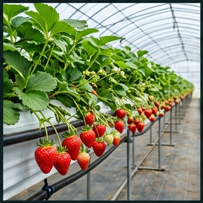

# 🍓 딸기 (Strawberry, *Fragaria × ananassa* Duch.)

## 분류
- **과**: 장미과 (Rosaceae) · **속**: 딸기속 (*Fragaria*)
- **카테고리**: 과수 (시설재배 위주, C₃) · **배수체**: 8n = 56 (이질8배체)
- **한국 품종**: 설향(80%+), 금실, 죽향, 비타베리, 킹스베리

## 생산 현황
| 항목 | 값 |
|------|------|
| 전국 재배면적 | 약 6,800 ha ([통계청, 2024](https://kosis.kr)) |
| 평균 수량 | **3,200 kg/10a** (시설) |
| HI | 0.55 · RUE 1.7 g/MJ |
| 세계 점유율 | 한국 딸기 종자 세계 점유율 7% ([KREI, 2023](https://www.krei.re.kr)) |

---

## 🏆 지역별 유명 산지

| 지역 | 특징 |
|------|------|
| **논산** (충남) | 한국 딸기 수도. 전국 생산량 1위, 설향 품종 발원지. [논산딸기축제](https://www.nonsan.go.kr) |
| **담양** (전남) | 죽향 특산지, 대나무 유기질 퇴비 활용 |
| **진주** (경남) | 남부 시설재배, 11월~5월 연속 출하 |
| **산청** (경남) | 고냉지 여름딸기 (6~10월) 프리미엄 시장 |

### 📋 실제 농사 사례
> **논산 설향** (2023, [충남농업기술원](https://www.chungnam.go.kr/ares))  
> 단동 비닐하우스 700평. 9월 10일 정식, 12월~5월 수확.  
> 야간 최저 8°C 유지 (보온커튼 + 온풍기). Brix 12.5.  
> 수량 **3,800 kg/10a**, S등급.  
> 핵심: 8월 12시간 이하 **단일조건**에서 화아분화 유도 후 정식.

---

## 생육 모델

| 생육단계 | GDD | 기간 | 설명 |
|----------|-----|------|------|
| 활착기 | 50°C·일 | 7~14일 | 정식 후 새 뿌리 발생, 활착 |
| 영양생장기 | 200°C·일 | 30~50일 | 크라운 발달, 엽면적 확보 |
| 개화기 | 150°C·일 | 14~21일 | 화방 출현, 벌 수분 또는 인공수분 |
| 과실비대기 | 200°C·일 | 14~25일 | 화탁(果托) 비대, 착색 시작 |
| 수확 연속기 | — | 60~120일 | 연속 수확 (2~4화방 순차 출현) |

- **기본온도**: 5°C · **총 GDD**: 1,000°C·일

### 화아분화 생리 ([Hancock, 1999](https://doi.org/10.1079/9780851993195.0000))
- **단일조건**: 일장 **12시간 이하** + 기온 15~20°C에서 화아분화 유도
- **질소 제한**: 화아분화기 N 과다 → 영양생장 연장, 화아분화 지연
- **저온 축적**: 5°C 이하 200~400시간 → 휴면 타파

---

## 환경 요구

### 온도
| 항목 | 값 |
|------|------|
| 최적 주간/야간 | **18/8°C** |
| 과실 비대 최적 | 15~20°C (야간 5~10°C) |
| 치사 저온 | -10°C (크라운 동해) |
| 치사 고온 | **35°C** (**극도 고온 감수성** — 과실 연화, 꽃가루 불임) |

### 양분
- **NPK**: 8:5:10 (K 높음 — 당도↑, 과실 경도↑)
- [농촌진흥청 시설딸기 시비기준](https://www.nongsaro.go.kr)

### 병해
| 병해 | 병원체 | 트리거 | 일 피해 |
|------|--------|--------|---------|
| 잿빛곰팡이병 | *Botrytis cinerea* | 15~25°C, RH≥85% | **5%** |
| 흰가루병 | *Podosphaera aphanis* | 15~25°C, RH≥60% | 4% |
| 탄저병 | *Colletotrichum* | 25~35°C, RH≥85% | 3% |

---

## 참고 문헌
1. Hancock, J.F. (1999). *[Strawberries](https://doi.org/10.1079/9780851993195.0000)*. CABI Publishing.
2. 농촌진흥청 (2024). [딸기 시설재배 매뉴얼](https://www.nongsaro.go.kr). 농사로.
3. KREI (2023). [한국 딸기 산업 동향](https://www.krei.re.kr).