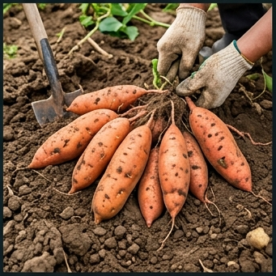

# 🍠 고구마 (Sweet Potato, *Ipomoea batatas* (L.) Lam.)

## 분류
- **과**: 메꽃과 (Convolvulaceae) · **속**: 고구마속 (*Ipomoea*)
- **카테고리**: 근채류 (C₃, 일부 C₃-C₄ 중간) · **배수체**: 6n = 90
- **원산지**: 중남미 (5,000년 전 재배화, [Roullier et al., 2013](https://doi.org/10.1073/pnas.1211049110))
- **한국 도입**: 1763년 (영조 39년) 조엄이 대마도에서 도입 ([농업유산](https://www.rda.go.kr))

## 생산 현황
| 항목 | 값 |
|------|------|
| 전국 재배면적 | 약 2.0만 ha ([통계청, 2024](https://kosis.kr)) |
| 평균 수량 | **2,000 kg/10a** |
| HI | 0.60 · RUE 2.0 g/MJ |

---

## 🏆 지역별 유명 산지

| 지역 | 특징 |
|------|------|
| **해남** (전남) | 한국 고구마 수도. 전국 생산량 1위. 황토 + 해양성 온난 기후. [해남군](https://www.haenam.go.kr) |
| **여주** (경기) | 밤고구마 특산지, 사양토 배수 우수 |
| **서산·당진** (충남) | 간척지 고구마, 호박고구마 명산지 |
| **무안** (전남) | 자색 고구마 특화 |

### 📋 실제 농사 사례
> **해남 꿀고구마 (베니하루카)** (2023)  
> 사양토, 5월 10일 삽식(꺾꽂이 정식) → 10월 5일 수확 (148일).  
> 여름 평균 27°C (최적). 괴근비대기 50일간 K₂O 추비.  
> Brix **24.5**, 수량 2,300 kg/10a, 특등급.  
> 핵심: 수확 후 **큐어링**(30~33°C, RH 85%, 5일) → 30% 당도 증가 + 저장성 향상.

---

## 생육 모델

| 생육단계 | GDD | 기간 | 설명 |
|----------|-----|------|------|
| 활착기 | 100°C·일 | 5~14일 | 삽식(꺾꽂이) 후 부정근 발생, 활착 |
| 만경생장기 | 600°C·일 | 30~45일 | 줄기·엽 급신장, 지상부 LAI 4~6 구축 |
| 괴근비대기 | 1,200°C·일 | 60~90일 | **핵심**: 저장근 비대, 전분·당 축적 |
| 성숙기 | 300°C·일 | 15~25일 | 괴근 표피 코르크화, 수확 가능 |

- **기본온도**: **15°C** (고온 작물 — 저온에 극도 약함)
- **총 GDD**: 3,200°C·일

### 괴근 비대 생리
- 부정근 → 저장근 전환은 **단일조건(12h 이하)**에서 촉진 ([Togari, 1950](https://doi.org/10.1270/jsbbs1951.1.96))
- 만경 과번무(N 과다) → 동화산물이 지상부에 소비 → 괴근 비대 억제 (**만경과번무 현상**)

---

## 환경 요구

### 온도
| 항목 | 값 |
|------|------|
| 최적 주간/야간 | **28/22°C** |
| 괴근비대 최적 토양온도 | 22~25°C |
| 치사 저온 | **5°C** ❄️ (극도 한랭 감수성) |
| 치사 고온 | 40°C |
| 가뭄 내성 | **0.6** (비교적 강 — 건조지에서도 재배) |

### 양분 ([농촌진흥청](https://www.nongsaro.go.kr))
- **NPK**: 3:5:12 — **K 매우 높음** (괴근 비대·전분 축적의 핵심)
- **N 제한**: N 과다 → 만경과번무 → 괴근 소형화
- 적합 토양: 사양토, 화산회토 (배수↑)

### 병해
| 병해 | 병원체 | 트리거 | 일 피해 |
|------|--------|--------|---------|
| 덩굴쪼김병 | *Fusarium oxysporum* | 25~35°C, 연작 | 5% |
| 무름병 | *Erwinia chrysanthemi* | 28~35°C, RH≥85% | 4% |

> **큐어링 기술**: 수확 직후 30~33°C, RH 85%에서 5일간 처리 → 상처 코르크화 + 전분→당 전환 → Brix 30%↑, 저장 6개월 가능

---

## 참고 문헌
1. Roullier, C. et al. (2013). [Historical collections reveal patterns of diffusion of sweet potato](https://doi.org/10.1073/pnas.1211049110). *PNAS*.
2. Togari, Y. (1950). [A study of tuberous root formation in sweet potato](https://doi.org/10.1270/jsbbs1951.1.96). *JSBBS*.
3. 농촌진흥청 (2024). [고구마 재배매뉴얼](https://www.nongsaro.go.kr). 농사로.