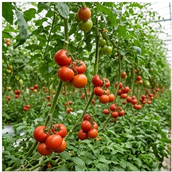

# 🍅 토마토 (Tomato, *Solanum lycopersicum* L.)

## 분류
- **과**: 가지과 (Solanaceae) · **속**: 토마토속 (*Solanum* sect. *Lycopersicon*)
- **카테고리**: 과채류 (C₃) · **원산지**: 남미 안데스~중미 ([Blanca et al., 2012](https://doi.org/10.1007/s00122-012-1891-z))
- **유전체**: 2n = 24, 게놈 900 Mb. 세계 최초 과채류 전체 게놈 해독 ([TGC, 2012](https://doi.org/10.1038/nature11119))
- **한국 재배 형태**: 90%+ 시설재배 (비닐하우스·유리온실)

## 생산 현황
| 항목 | 값 |
|------|------|
| 전국 재배면적 | 약 6,700 ha ([통계청, 2024](https://kosis.kr)) |
| 평균 수량 | **10,000 kg/10a** (시설) |
| HI | 0.60 · RUE 2.5 g/MJ (C₃ 중 높음) |

---

## 🏆 지역별 유명 산지

| 지역 | 특징 |
|------|------|
| **부여** (충남) | 토마토 특구. 벤로형 유리온실 첨단 시설재배. [부여군](https://www.buyeo.go.kr) |
| **익산** (전북) | 방울토마토 전국 1위 |
| **화순** (전남) | 남부 시설토마토, 겨울 출하 |
| **춘천** (강원) | 고품질 완숙토마토 |

### 📋 실제 농사 사례
> **부여 유리온실 토마토** (2023, [충남농업기술원](https://www.chungnam.go.kr/ares))  
> 벤로형 유리온실 2,000평. 양액재배(코이어 배지).  
> 연중 25/18°C 유지. 연간 수량 **15,000 kg/10a**.  
> Brix 6.2 (완숙 수확). 연 12개월 연속 출하.  
> 핵심: **영양생장-생식생장 균형** — 제1화방 하 3엽 확보 후 착과.

---

## 생육 모델 ([DSSAT CROPGRO-Tomato](https://dssat.net/))

| 생육단계 | GDD | 기간 | 설명 |
|----------|-----|------|------|
| 발아기 | 60°C·일 | 5~10일 | 25~30°C 최적. 35°C 이상 발아 억제 |
| 유묘기 | 200°C·일 | 20~30일 | 본엽 6~8매 정식 적기 |
| 영양생장기 | 300°C·일 | 20~30일 | 줄기·엽 급신장, LAI 3~5 |
| 개화착과기 | 200°C·일 | 10~15일 | 제1화방 개화. 호르몬 처리 또는 벌 수분 |
| 과실비대기 | 400°C·일 | 30~45일 | 세포 비대, 리코펜 축적 시작 |
| 착색성숙기 | 200°C·일 | 10~20일 | 에틸렌 분비 → 엽록소 분해, **리코펜** 합성 |

- **기본온도**: 10°C · **총 GDD**: 1,500°C·일

### 리코펜 합성 ([Dumas et al., 2003](https://doi.org/10.1021/jf0026541))
- 최적 합성 온도: 22~25°C. 30°C 이상에서 합성 억제
- 광(光) 비의존적 — 차광 환경에서도 합성 가능
- 완숙 과실: 리코펜 35~120 mg/kg FW

---

## 환경 요구

### 온도
| 항목 | 값 |
|------|------|
| 최적 주간/야간 | **25/18°C** |
| 화분 불임 | **35°C** 이상 지속 시 (화분관 신장 억제) |
| 치사 저온 | **2°C** (가지과 공통 — 저온 감수성) |
| 착과 최적 야간 | 15~20°C |

### 양분 ([농촌진흥청](https://www.nongsaro.go.kr))
- **NPK**: 8:4:8 · 시설재배 양액 EC 2.0~2.5 dS/m
- Ca 결핍 → **배꼽썩음과**(Blossom-end rot) : 가장 흔한 생리장해

### 병해
| 병해 | 병원체 | 트리거 | 일 피해 |
|------|--------|--------|---------|
| 잿빛곰팡이병 | *Botrytis cinerea* | 15~25°C, RH≥85% | 5% |
| 역병 | *Phytophthora infestans* | 18~25°C, RH≥85% | 4% |
| 잎마름병 | *Alternaria solani* | 20~30°C, RH≥80% | 3% |
| 토마토황화잎말림바이러스 | TYLCV (담배가루이 매개) | 25~35°C | 6% |

> ⚠️ **TYLCV**: 동남아·지중해 유래 바이러스. 2008년 한국 첫 발생 이후 시설토마토 최대 위협. **담배가루이(Bemisia tabaci)** 매개. 저항성 품종 + 황색 끈끈이 트랩 방제. ([Lee et al., 2010](https://doi.org/10.5423/PPJ.2010.26.2.107))

---

## 참고 문헌
1. Blanca, J. et al. (2012). [Variation in tomato revealed by SNP arrays](https://doi.org/10.1007/s00122-012-1891-z). *Theor. Appl. Genet.*
2. TGC (2012). [The tomato genome sequence](https://doi.org/10.1038/nature11119). *Nature*, 485.
3. Dumas, Y. et al. (2003). [Effects of environmental factors on lycopene](https://doi.org/10.1021/jf0026541). *J. Food Comp. Anal.*
4. Lee, G.S. et al. (2010). [Occurrence of TYLCV in Korea](https://doi.org/10.5423/PPJ.2010.26.2.107). *Plant Pathol. J.*
5. 농촌진흥청 (2024). [토마토 시설재배 매뉴얼](https://www.nongsaro.go.kr). 농사로.
6. Heuvelink, E. (2005). *Tomatoes*. CABI Publishing.