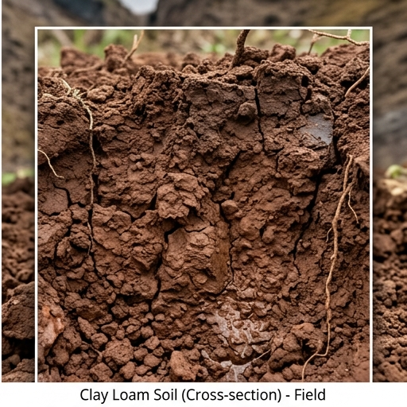

# 🧱 식양토 (Clay Loam) — Alfisol

## USDA 분류: [Alfisol](https://www.nrcs.usda.gov/resources/guides-and-instructions/soil-taxonomy)
점토 함량 높아 **양분·수분 보유력 우수**. 벼·채소에 양호.

## 물리·화학적 특성
| 항목 | 값 |
|------|------|
| 토성 | 식양토 (Sand 30% · Silt 35% · Clay **35%**) |
| pH | 5.5~7.0 |
| 유기물 | **3.2%** |
| 포장용수량 | **0.38** · 위조점 0.20 |
| 유효수분 | **180 mm/m** |
| CEC | **22** cmol⁺/kg (높음) |
| 유효토심 | 80cm |
| 배수 | 보통 (Ksat 8 mm/day) |

## 양분: N 140 · P 95 · K 180 mg/kg (**양분 보유력 우수**)

## 작물 적합도
| 작물군 | 적합도 |
|--------|--------|
| 벼 | ★★★★☆ — 담수 유지 가능 |
| 채소 | ★★★★☆ — 양분 풍부 |
| 과수 | ★★★☆☆ — 배수 불량 시 근 부패 |
| 근채 | ★★★☆☆ — 점토 → 수확 어려움, 괴경 형태 불량 |

> ⚠️ **과습 주의**: 점토 함량 35% → 배수 불량 시 **혐기 조건** 발생 → 뿌리 산소 부족. 배수로·암거배수 설치 필수.

## 분포
호남평야, 충청 내륙, 경기 남부

## 참고
1. [국립농업과학원 흙토람](https://soil.rda.go.kr)
