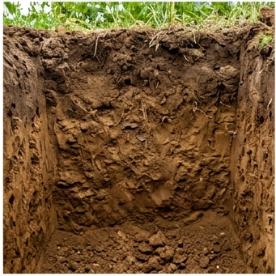

# 🪨 충적양토 (Alluvial Loam) — Entisol

## USDA 분류: [Entisol (Fluvents)](https://www.nrcs.usda.gov/resources/guides-and-instructions/soil-taxonomy)
하천 퇴적작용으로 형성된 농업 최적 토양. 한국 농경지의 약 **30%**를 차지.

## 물리·화학적 특성
| 항목 | 값 | 단위 |
|------|------|------|
| 토성 | 양토 (Loam) | Sand 40% · Silt 40% · Clay 20% |
| pH | 5.5~6.5 (최적 6.0) | |
| 유기물 | 2.8 | % |
| 용적밀도 | 1.35 | g/cm³ |
| 공극률 | 48 | % |
| 포장용수량 (FC) | 0.32 | m³/m³ |
| 위조점 (WP) | 0.14 | m³/m³ |
| 유효수분 | **180** | mm/m |
| CEC | 15 | cmol⁺/kg |
| 유효토심 | 90 | cm |
| 배수 등급 | 양호 | |
| 투수계수(Ksat) | 18 | mm/day |

## 양분 함량 ([국립농업과학원 흙토람](https://soil.rda.go.kr))
| 성분 | 함량 (mg/kg) |
|------|-------------|
| 질소(N) | 120 |
| 인(P) | 85 |
| 칼륨(K) | 150 |
| 칼슘(Ca) | 1,200 |
| 마그네슘(Mg) | 180 |

## 작물 적합도
| 작물군 | 적합도 | 이유 |
|--------|--------|------|
| 벼 | ★★★★☆ (0.85) | 충적지 논 조성에 양호 |
| 채소 | ★★★★★ (0.90) | **범용 최적 토양** — 양분·배수·보수력 균형 |
| 과수 | ★★★★☆ (0.80) | 배수 관리 시 양호 |
| 근채 | ★★★★☆ (0.75) | 적합, 다만 사양토보다 수확 난이도↑ |

## 분포 지역
**서해안 평야, 김제, 논산, 예산, 이천, 여주** — 한국 주요 곡창지대

## 참고
1. [국립농업과학원 흙토람](https://soil.rda.go.kr)
2. [USDA Soil Taxonomy](https://www.nrcs.usda.gov/resources/guides-and-instructions/soil-taxonomy)
