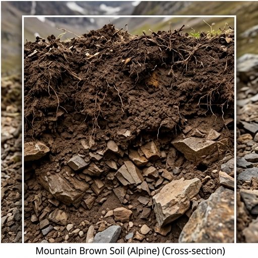

# 🏔️ 산악갈색토 (Mountain Brown Forest Soil) — Inceptisol (Udepts)

## USDA 분류: [Inceptisol (Udepts)](https://www.nrcs.usda.gov/resources/guides-and-instructions/soil-taxonomy)
산지 냉량 환경에서 형성된 **미숙 토양**. 고냉지 채소 재배의 기반.

## 물리·화학적 특성
| 항목 | 값 | 비고 |
|------|------|------|
| 토성 | 양토~사양토 | 모래+자갈 함량 높음, 자갈 혼입 |
| pH | 4.5~5.5 (산성) | 침엽수 낙엽에 의한 산성화 |
| 유기물 | **4.5%** | 저온 → 유기물 분해 느림 → 축적 |
| 포장용수량 | 0.28 · 위조점 0.12 |
| CEC | 12 cmol⁺/kg |
| 유효토심 | **50cm** (⚠️ 얕음) | 기반암 근접 |
| 배수 | 양호~과잉 (Ksat 25 mm/day) | 경사지 자연 배수 |

### 토양 깊이 제한의 의미
- 유효토심 50cm → **심근성 작물(과수 등) 뿌리 발달 제한**
- 대신 천근성 채소(배추·시금치·감자)에는 충분
- 경사지 → 표토 유실(erosion) 주의. 등고선 재배 필수

## 양분: N 100 · P 65 · K 120 mg/kg

## 작물 적합도
| 작물군 | 적합도 | 이유 |
|--------|--------|------|
| 채소 | ★★★★☆ | **고냉지 배추·시금치 최적** — 냉량 기후와 시너지 |
| 근채 | ★★★★☆ | 감자 (사양토적 특성 → 괴경 형태↑) |
| 과수 | ★★★☆☆ | 토심 얕아 제한적. 사과는 해발 3~400m 이하에서 |
| 벼 | ★☆☆☆☆ | **불적합** — 경사지, 배수 과잉, 한랭 |

## 분포
**강원도 산간** — 대관령, 평창, 태백, 정선 (해발 600m 이상)

> 🔑 **고냉지 농업의 토양적 기반**: 산악갈색토의 유기물 풍부(4.5%) + 배수 양호 + 냉량 기후 = 여름 배추·감자에 최적 조합. 평지에서 구현 불가능한 고유 이점.

## 참고
1. [국립농업과학원 흙토람](https://soil.rda.go.kr)
2. Jung, Y.T. et al. (2002). 한국 산림토양의 분류체계. *한국토양비료학회지*.
