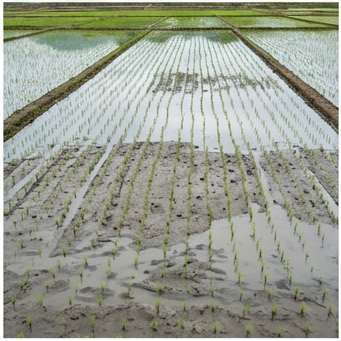

# 🌾 논토양 (Paddy Gley) — Inceptisol (Aquepts)

## USDA 분류: [Inceptisol (Aquepts)](https://www.nrcs.usda.gov/resources/guides-and-instructions/soil-taxonomy)
장기간 **담수 관리**로 형성된 환원층(글레이층)을 가진 벼 전용 토양. 한국 논 면적 약 90만 ha의 기반.

## 물리·화학적 특성
| 항목 | 값 | 비고 |
|------|------|------|
| 토성 | 미사질양토 (Silt Loam) | Sand 20% · Silt 50% · Clay 30% |
| pH | 5.0~6.5 | 담수 시 pH 중성화 경향 (Fe²⁺ 환원) |
| 유기물 | **4.0%** | 혐기 조건으로 분해 느려 축적 |
| 포장용수량 | **0.42** | 전 토양 중 최고 수준 |
| 위조점 | 0.22 | |
| 유효수분 | **200 mm/m** | |
| CEC | 18 cmol⁺/kg | |
| 유효토심 | 80cm | |
| 배수 등급 | **불량** (Ksat 5 mm/day) | 경반층(plow pan) 형성 |

### 환원층(Glei Horizon)의 형성 과정 ([Ponnamperuma, 1972](https://doi.org/10.1016/S0065-2113(08)60275-6))
1. 담수 → 토양 중 O₂ 고갈 (2~4일 내)
2. 혐기성 미생물이 Fe³⁺ → Fe²⁺ 환원 (환원전위 Eh < -200mV)
3. Fe²⁺ 이동 → 회색(glei) 환원층 형성
4. 메탄(CH₄) 생성 — 논은 전 세계 CH₄ 배출의 **10~12%** 차지

## 양분: N **150** · P 100 · K 130 · Ca 1,000 · Mg 200 mg/kg

## 작물 적합도
| 작물군 | 적합도 | 이유 |
|--------|--------|------|
| **벼** | ★★★★★ (**0.95**) | **최적** — 담수 환경에 완벽 적응 |
| 채소 | ★★☆☆☆ | 배수 개선 없이 불가. 밭전환 시 배수 투자 필요 |
| 과수 | ★☆☆☆☆ | **부적합** — 근 부패 위험 |
| 근채 | ★★☆☆☆ | 배수 불량 → 괴경 부패 |

> ⚠️ **밭작물 전환 시**: 암거배수(지하 배수관) 설치 필수. 비용 200~300만원/10a. 전환 후 2~3년 토양 산화 과정 필요.

## 분포
**전국 논 지대** — 호남(김제·논산), 충남(예산·당진), 경기(이천·여주)

## 참고
1. Ponnamperuma, F.N. (1972). [The chemistry of submerged soils](https://doi.org/10.1016/S0065-2113(08)60275-6). *Adv. Agron.*, 24.
2. [국립농업과학원 흙토람](https://soil.rda.go.kr)
