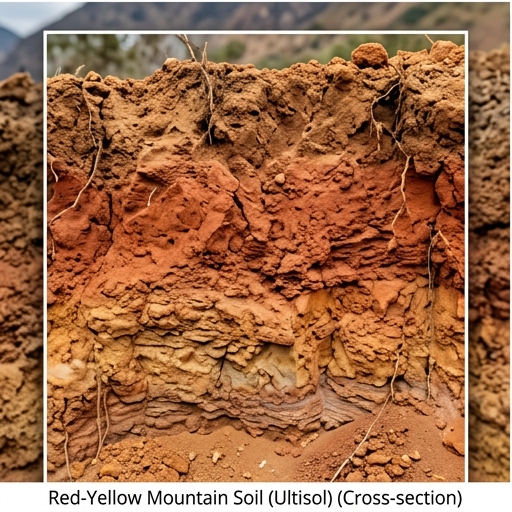

# 🟤 적황색토 (Red-Yellow Soil) — Ultisol

## USDA 분류: [Ultisol](https://www.nrcs.usda.gov/resources/guides-and-instructions/soil-taxonomy)
온난습윤 기후에서 **강한 풍화**를 받아 산화철(Fe₂O₃)로 붉은 색을 띠는 산성 토양.

## 물리·화학적 특성
| 항목 | 값 |
|------|------|
| 토성 | 식토~식양토 (Clay 30~45%) |
| pH | **4.5~5.5** (강산성 ⚠️) |
| 유기물 | 2.2% |
| 포장용수량 | 0.30 · 위조점 0.16 |
| CEC | 14 cmol⁺/kg (낮음 — 1:1 점토광물 우세) |
| 유효토심 | 80cm |
| 배수 | 양호 |

### 산성 토양의 알루미늄 독성 ([Kochian et al., 2004](https://doi.org/10.1146/annurev.arplant.55.031903.141655))
- pH < 5.0 → **교환성 Al³⁺** 용출 → 뿌리 신장 억제
- Al 독성 증상: 근단 갈변, 측근 발달 불량, 양분 흡수 저해
- **석회 시용** 필수: 소석회 1~2톤/10a → pH 5.5~6.0 교정
- 또는 내산성 품종 사용 (콩·차·블루베리)

## 양분: N 90 · P 55 · K 110 mg/kg

## 작물 적합도
| 작물군 | 적합도 | 이유 |
|--------|--------|------|
| 과수 | ★★★★☆ | 석회 교정 후 사과·포도 양호 |
| 근채 | ★★★☆☆ | 점토 함량 → 수확 난이 |
| 채소 | ★★★☆☆ | pH 교정 필수 |
| 벼 | ★★★☆☆ | 논 조성 시 가능 |

## 분포
경상도 구릉지, 전남 해안지대, 충북 산지

## 참고
1. Kochian, L.V. et al. (2004). [How do crop plants tolerate acid soils?](https://doi.org/10.1146/annurev.arplant.55.031903.141655). *Annu. Rev. Plant Biol.*
2. [국립농업과학원 흙토람](https://soil.rda.go.kr)
