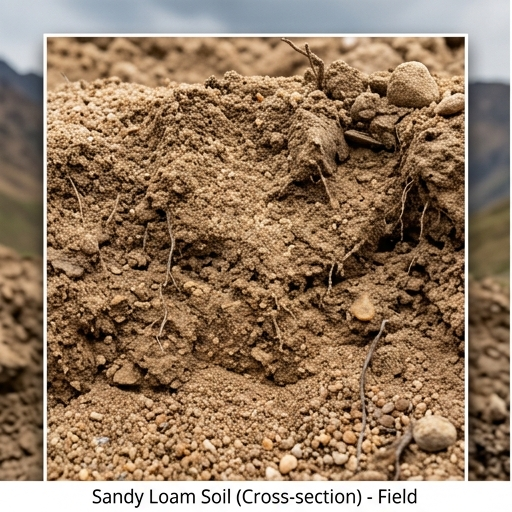

# 🏖️ 사양토 (Sandy Loam) — Inceptisol

## USDA: Inceptisol
모래 함량 높아 배수 매우 양호. pH 5.0~6.0 · 유기물 2.0% · CEC 11  
포장용수량 0.22 · 위조점 0.08 · 유효토심 70cm

## 적합도
근채 ★★★★★ · 과수 ★★★★☆ · 채소 ★★★★☆ · 벼 ★★☆☆☆

> **보수력 낮아 관수 필수**. 감자·고구마·포도에 최적.

## 분포: 낙동강 유역, 해안가, 경기 북부, 여주

