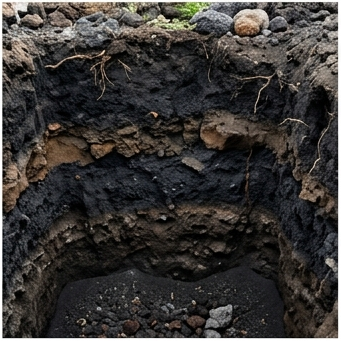

# 🌋 화산회토 (Volcanic Andisol)

## USDA 분류: [Andisol](https://www.nrcs.usda.gov/resources/guides-and-instructions/soil-taxonomy)
화산 분출물(테프라)로 형성된 특수 토양. **한국에서는 제주도에만 분포**.

## 물리·화학적 특성
| 항목 | 값 | 비고 |
|------|------|------|
| 토성 | 미사질양토 | 화산유리 함량 높음 |
| pH | **4.5~5.5** (산성) | 활성 Al → 강산성 |
| 유기물 | **12.0%** 🔝 | 전국 최고. 알로페인-부식 복합체로 안정화 |
| 포장용수량 | **0.50** 🔝 | 전 토양 중 최고 |
| 위조점 | 0.25 | |
| 유효수분 | **300 mm/m** 🔝 | 보수력 탁월 |
| CEC | **28** cmol⁺/kg | 높으나 pH 의존적 |
| 공극률 | **65%** | 통기성 매우 우수 |
| 유효토심 | **120cm** | 깊음 |

### 인산 고정 메커니즘 ([Shoji et al., 1993](https://doi.org/10.1016/S0166-2481(08)70261-4))
- **활성 알루미늄(Al)·철(Fe)**이 인산(PO₄³⁻)을 강력히 흡착
- 인산 고정도: **85~95%** (투입 인산의 85~95%가 고정)
- 결과: **인산 시비량 일반 토양 대비 2~3배** 필요
- 대책: 용과린(용성인비) 사용, 유기물 시용으로 Al 활성 감소

## 작물 적합도
| 작물군 | 적합도 | 이유 |
|--------|--------|------|
| 근채 | ★★★★☆ | 배수↑, 토심↑, 당근·감자 우수 |
| 과수 | ★★★★☆ | 감귤에 최적, 보수력 풍부 |
| 채소 | ★★★★☆ | 시설재배 시 양호 |
| 벼 | ★★☆☆☆ | 배수 과다 → 담수 곤란 |

## 분포
**제주도** — 한국 유일의 화산회토 분포 지역. 면적 약 1,800km²

## 참고
1. Shoji, S. et al. (1993). *[Volcanic Ash Soils: Genesis, Properties and Utilization](https://doi.org/10.1016/S0166-2481(08)70261-4)*. Elsevier.
2. [국립농업과학원 흙토람](https://soil.rda.go.kr)
